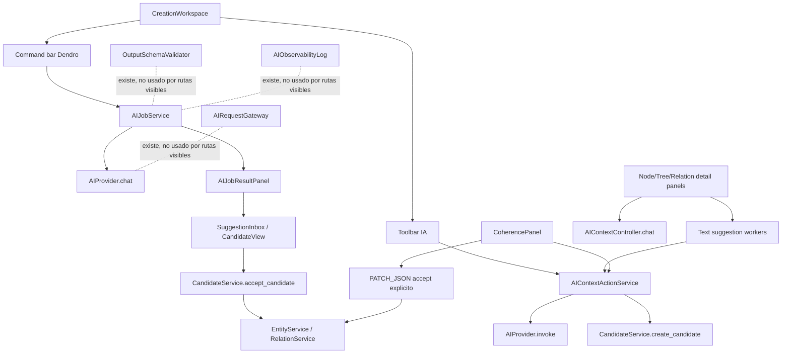

# D01 - Auditoria de IA de producto

Fecha: 2026-06-11
Ticket: BETA1-D01
Estado: listo para revision

## Alcance

Esta auditoria inventaria las rutas IA existentes y decide que piezas deben
mantenerse, envolverse, ocultarse o tratarse como legado antes de D02-D05.
No implementa nuevas acciones IA.

Fuentes revisadas:

- `packages/application/ai_request_gateway.py`
- `packages/application/ai_jobs.py`
- `packages/application/ai_context_actions.py`
- `packages/application/ai_observability.py`
- `packages/application/context_sanitizer.py`
- `packages/application/output_schema_validator.py`
- `packages/application/prompt_registry.py`
- `packages/application/candidate_service.py`
- `packages/application/orchestrator_service.py`
- `packages/infrastructure/ai_provider.py`
- `hosts/DesktopHostPySide/controllers/ai_controller.py`
- `hosts/DesktopHostPySide/controllers/ai_context_controller.py`
- `hosts/DesktopHostPySide/views/workspaces.py`
- `hosts/DesktopHostPySide/widgets/node_detail_panel.py`
- `hosts/DesktopHostPySide/widgets/tree_detail_panel.py`
- `hosts/DesktopHostPySide/widgets/relation_detail_panel.py`
- `hosts/DesktopHostPySide/widgets/coherence_panel.py`

## Resumen ejecutivo

El producto ya tiene una base canon-safe razonable: la command bar crea jobs
revisables, las acciones contextuales producen candidatos o previews, y la
aceptacion canonica pasa por servicios de aplicacion. Aun asi, el pipeline no
esta unificado. Las piezas B42 (`AIRequestGateway`, `ContextSanitizer`,
`OutputSchemaValidator`, `AIObservabilityLog`) existen y tienen tests, pero no
estan conectadas a las rutas visibles principales.

La decision para D02-D05 debe ser envolver las rutas utiles, no rehacerlas:

- Mantener `AIJobService` como nucleo de command bar, pero hacerlo pasar por
  gateway, validador y observabilidad.
- Mantener `AIContextActionService` como nucleo contextual, pero eliminar llamadas
  directas no trazadas a provider y normalizar sus salidas.
- Ocultar del runtime visible los chats directos y `OrchestratorService`; deben
  quedar solo para compatibilidad o pruebas antiguas.
- Declarar contrato explicito de salida: `preview`, `candidate`, `suggestion`,
  `issue` y `explanation`, nunca mutacion canon directa.

## Mapa actual

## Inventario de componentes

| Componente | Estado | Decision | Observaciones |
|---|---:|---|---|
| `PromptRegistry` | funcional | KEEP | Centraliza `command_bar`, `inline_leaf`, `inline_branch`, `inline_relation`, `coherence`, `coherence_repair`, `wizard_suggestion`. Falta metadata de owner, output type y visibilidad. |
| `AIRequestGateway` | funcional aislado | WRAP | Tiene sanitizacion, parametros y metadata, pero no se usa en command bar ni acciones contextuales. La docstring promete validacion, pero `execute()` no llama a `validate_ai_output`. Sanitiza solo top-level. |
| `ContextSanitizer` | funcional aislado | WRAP | Tiene `sanitize_ai_context` y `sanitize_nested`; las rutas principales no lo usan. D02 debe hacerlo obligatorio. |
| `OutputSchemaValidator` | funcional aislado | WRAP | Tiene tests B42. No esta conectado. Sus schemas esperan `entities/trees`, mientras el prompt actual usa tambien `hojas/ramas`; necesita normalizacion antes de activar strict mode. |
| `AIObservabilityLog` | funcional aislado | WRAP | Ring buffer en memoria, sin raw prompt salvo debug. No recibe registros desde jobs visibles. Es base directa de D05. |
| `AIJobService` | funcional visible | KEEP + WRAP | Command bar no bloqueante via `_AIJobWorker`. Falla claramente si solo hay provider simulado. Produce resultados revisables. Falta gateway, schema validation, observabilidad, timeout explicito y cancelacion real de llamada provider. |
| `AIContextActionService` | funcional visible/parcial | KEEP + WRAP | Construye contexto autorizado y produce candidatos/previews. Mezcla `provider.chat` y `provider.invoke`, no usa gateway, validador ni observabilidad. |
| `CandidateService` | funcional | KEEP | La IA crea candidatos; aceptar puede crear entidad/relacion mediante servicios. Eso es canon-safe si la aceptacion es explicita. Candidatos `sugerencia_ia` no aplican cambios estructurales por si solos. |
| `AIContextController` | funcional | WRAP/HIDE | Buen adaptador para UI contextual. Expone `chat()` directo; debe ocultarse para acciones de producto o envolverlo como refine action trazable. |
| `AIController` | legacy visible parcial | LEGACY/HIDE | Usa `OrchestratorService`. Sirve para estado/test de provider; `generate_entity_candidates` y `rewrite_entity` no deben ser rutas nuevas. |
| `OrchestratorService` | legacy | LEGACY | Marcado en codigo como legacy B42+. Usa `provider.invoke()` y contexto basico. Debe salir del runtime de producto cuando D02-D05 esten listas. |
| `SimulatedAIProvider` | funcional test/smoke | KEEP limitado | Util para smoke tests y dev. En producto no debe presentarse como exito real para command bar. |

## Prompts registrados

| Prompt | Version | Idiomas | Estado | Notas |
|---|---:|---|---|---|
| `command_bar` | 2 | es | KEEP + WRAP | Prompt principal de Dendro. Canon-safe y JSON estructurado. Falta variante `en`. |
| `inline_leaf` | 1 | es/en | KEEP + WRAP | Devuelve solo texto, no JSON. Visible en hoja. |
| `inline_branch` | 1 | es/en | KEEP | Registrado; la ruta de rama usa `node_text_suggestion`, por lo que no queda claro si este prompt se invoca. |
| `inline_relation` | 1 | es/en | KEEP + WRAP | Visible en relacion. |
| `coherence` | 1 | es/en | KEEP + WRAP | Visible desde seleccion, hoja y relacion. |
| `coherence_repair` | 1 | es/en | WRAP | Genera patch revisable, pero la validacion UI es regex/JSON local; no pasa por schema validator. |
| `wizard_suggestion` | 1 | es/en | KEEP/HIDE | Util para configuracion. No pertenece al set minimo de Creacion D04 salvo decision expresa. |

## Acciones visibles en Creacion

| Superficie UI | Ruta | Estado | Decision |
|---|---|---:|---|
| Command bar "Dendro" + boton "Crear" | `CreationWorkspace._submit_ai_command` -> `AIJobService` -> `_AIJobWorker` | visible funcional | KEEP + WRAP |
| Panel "Tareas IA" | `AIJobsPanel` | visible funcional | KEEP |
| Panel "Resultado de Dendro" | `AIJobResultPanel` -> `CandidateController.create` | visible funcional | KEEP |
| Bandeja de sugerencias | `SuggestionInboxPanel` / `CandidateView` -> `CandidateService` | visible funcional | KEEP |
| Boton "Sugerir hoja con IA" | `_SuggestWorker` -> `AIContextController.graph_action("suggest_missing_nodes")` | visible funcional con provider | KEEP + WRAP |
| Ruta `_suggest_relation` | `graph_action("suggest_missing_relations")` | no visible actualmente | HIDE hasta D04 |
| Boton de coherencia de seleccion | `CoherencePanel` -> `analyze_coherence` / `repair_coherence` | visible funcional | KEEP + WRAP |
| Hoja: "Generar sugerencia" | `_NodeAIWorker` -> `node_text_suggestion` | visible funcional | KEEP + WRAP |
| Hoja: "Refinar" | `_NodeRefineWorker` -> `AIContextController.chat` | visible funcional pero no trazado | WRAP |
| Hoja: expandir/explicar causas | `_NodeContextActionWorker` -> `node_action` | visible funcional/parcial | KEEP + WRAP |
| Rama: descripcion, miembros, subarboles, coherencia, preguntas | `_TreeAIWorker` -> `node_text_suggestion` | visible funcional pero semantica mezclada | WRAP |
| Rama: expandir/explicar causas | `_TreeContextActionWorker` -> `node_action` | visible funcional/parcial | KEEP + WRAP |
| Relacion: sugerencia/refinado | `_RelationAIWorker` / `_RelationRefineWorker` | visible funcional | WRAP |
| Relacion: coherencia | `CoherencePanel` | visible funcional | KEEP + WRAP |
| Ajustes/provider test | `AIController.provider_status/test_provider` | visible parcial | KEEP solo diagnostico |

## Rutas no visibles o legacy

| Ruta | Estado | Decision |
|---|---:|---|
| `AIController.generate_entity_candidates` | no visible/legacy | HIDE |
| `AIController.rewrite_entity` | no visible/legacy | HIDE |
| `AIController.chat` | no visible como producto | HIDE/INTERNAL |
| `AIContextController.chat` | usado por refine | WRAP en accion trazable |
| `OrchestratorService.invoke/generate_candidates` | legacy | REMOVE-LATER |
| `AIProvider.invoke` en rutas contextuales | activo | WRAP con gateway o contrato D02 |
| `openai_compatible_provider.invoke` | legacy compatible | KEEP solo adaptador hasta migracion |

## Problemas detectados

1. Pipeline fragmentado. La command bar, las acciones contextuales y los refinados
   hablan con provider por rutas distintas.
2. La validacion estructural no protege las rutas visibles. `_extract_json()` es
   permisivo y `CoherencePanel` valida patch por regex/JSON local.
3. La observabilidad existe, pero no hay request/job trace comun en runtime.
4. La sanitizacion profunda existe, pero no se aplica antes de todos los calls.
5. La cancelacion de jobs es administrativa: puede marcar cancelado, pero no
   interrumpe una llamada provider ya iniciada.
6. El timeout es inconsistente. Algunas llamadas directas usan env var en
   controladores; otras llaman provider sin timeout explicito.
7. El fallback simulado es desigual. Command bar falla si no hay provider real,
   pero acciones contextuales pueden devolver texto simulado.
8. La semantica de rama reutiliza rutas de nodo (`node_text_suggestion`), lo que
   funciona tecnicamente pero debe nombrarse bien en contrato D02.
9. Hay acciones no visibles (`_suggest_relation`) y legacy (`OrchestratorService`)
   que pueden confundir el mapa de producto.
10. El contrato canon-safe esta disperso en comentarios, prompts y UI; falta un
    guardrail de arquitectura que sea testeable.

## Clasificacion final

KEEP:

- `PromptRegistry`
- `AIJobService`
- `AIContextActionService`
- `CandidateService`
- `AIJobsPanel`, `AIJobResultPanel`, bandeja de sugerencias
- `CoherencePanel`, con validacion reforzada en D02-D03
- `SimulatedAIProvider` para tests/smoke, no como exito de producto

WRAP:

- `AIRequestGateway`
- `ContextSanitizer`
- `OutputSchemaValidator`
- `AIObservabilityLog`
- `AIContextController.chat` usado por refine
- Rutas inline de hoja, rama y relacion
- Reparacion de coherencia

HIDE:

- `_suggest_relation` hasta que D04 la haga accion minima real
- `AIController.chat` como accion de producto
- `AIController.generate_entity_candidates`
- `AIController.rewrite_entity`

LEGACY / REMOVE-LATER:

- `OrchestratorService`
- `provider.invoke()` como API directa de features nuevas

## Recomendacion para D02-D05

D02 debe definir y testear el contrato:

- IA nunca llama directamente a servicios de canon salvo en una ruta de aceptacion
  explicita del usuario.
- Toda salida IA visible se normaliza como `preview`, `candidate`, `suggestion`,
  `issue` o `explanation`.
- Toda salida estructural pasa por schema/normalizer antes de entrar en
  `CandidateService`.
- Todo contexto pasa por sanitizacion profunda.

D03 debe unificar ejecucion:

- `AIJobService` o una fachada equivalente debe ser el runner comun.
- Cada request debe tener `request_id`, estado, timeout, error seguro y resultado
  revisable.
- Las llamadas UI siguen en workers, pero la logica de estado no debe vivir en
  cada panel.

D04 debe exponer solo el set minimo:

- Mejorar texto de hoja/rama/relacion.
- Sugerir relaciones desde seleccion.
- Analizar coherencia.
- Explicar causas/consecuencias en worldbuilding.

D05 debe conectar trazabilidad:

- Registrar provider, intent, target, output type, duracion, estado y error type.
- No guardar prompt bruto salvo modo debug explicito.
- Mostrar fallo de provider real sin vender salida simulada como producto.

## Veredicto

D01 queda completo a nivel de auditoria. La app no necesita una reescritura de IA;
necesita cerrar el contrato y envolver las rutas existentes. El mayor riesgo para
la beta no es que la IA modifique canon automaticamente hoy, sino que las rutas
visibles no comparten validacion, sanitizacion, observabilidad ni politica de
fallback.
