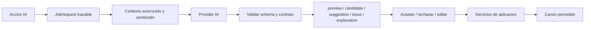

# D02 - Contrato IA canon-safe

Fecha: 2026-06-11
Ticket: BETA1-D02
Estado: listo para revision

## Principio

La IA de Dendro asiste al autor, pero no escribe canon directamente. Toda accion
IA debe terminar en uno de estos resultados:

- `preview`: texto efimero mostrado en un panel. Solo modifica el formulario si
  el usuario pulsa aceptar, y el guardado posterior pasa por servicios de UI.
- `candidate`: propuesta persistente en la bandeja de sugerencias. Solo entra al
  canon al aceptar explicitamente el candidato.
- `suggestion`: informe o propuesta revisable sin aplicacion estructural directa.
- `issue`: incidencia estructurada para revision.
- `explanation`: explicacion no persistente, salvo que el usuario la convierta en
  candidato o texto aceptado.

El grafo no es la base de datos: la IA nunca debe crear nodos, relaciones,
anillos ni cambios de canon desde la vista. La vista solo dispara acciones y
muestra resultados.

## Flujo obligatorio

Ninguna flecha puede saltar de `Model` a `Services` o `Canon`.

## Prohibiciones

Las rutas IA no pueden:

- Llamar directamente a `EntityService.create_entity()`.
- Llamar directamente a `RelationService.create_relation()`.
- Llamar directamente a `EntityService.update_entity()`.
- Llamar directamente a `RelationService.update_relation()`.
- Escribir en `ProjectStore` o en persistencia.
- Cambiar `canon_state`, `visibility_state`, `reviewed_at` o `final_action`.
- Devolver banderas como `auto_accept`, `auto_apply`, `apply_directly`,
  `mutate_canon`, `canonize` o equivalentes.
- Tratar candidatos no aceptados como hechos de canon.

La unica excepcion es una ruta de aceptacion explicita iniciada por el usuario:
`CandidateService.accept_candidate()` puede llamar a `EntityService` o
`RelationService` porque ya no es una accion del modelo, sino una decision humana.

## Reglas positivas

Toda ruta IA debe:

- Construir contexto desde servicios de aplicacion o builders autorizados.
- Sanitizar contexto antes de enviarlo a provider.
- Validar salida estructural antes de convertirla en candidato.
- Registrar source IA, timestamp, prompt/request id cuando el resultado persiste.
- Devolver errores seguros si no hay provider real configurado.
- Mantener la app usable sin IA.

## Contrato por tipo de salida

| Tipo | Persistencia | Puede tocar canon | Ruta de aceptacion |
|---|---:|---:|---|
| `preview` | No, salvo stash temporal UI | No | Usuario acepta texto y guarda por controller |
| `candidate` | Si, en `project.candidates` | No | `CandidateService.accept_candidate()` |
| `suggestion` | Opcional como candidato `sugerencia_ia` | No | Decision manual posterior |
| `issue` | Opcional como incidencia/candidato | No | Revision manual |
| `explanation` | No por defecto | No | Convertir explicitamente |

## Estado del codigo tras D02

- `output_schema_validator` rechaza JSON estructurado que contenga claves de
  mutacion directa.
- `AIRequestGateway` usa `sanitize_nested()` para contexto profundo.
- `AIRequestGateway` llama a `validate_ai_output()` y devuelve error de
  validacion cuando la salida estructural viola el contrato.
- Hay test estatico para impedir llamadas directas de `packages/application/ai_*.py`
  a `create_entity`, `create_relation`, `update_entity` o `update_relation`.

## Deuda que pasa a D03-D05

- Las rutas visibles aun no pasan todas por `AIRequestGateway`; D03 debe unificar
  ejecucion de jobs y request state.
- `AIContextActionService` todavia mezcla `provider.chat` y `provider.invoke`;
  D03/D04 deben envolver esas llamadas.
- `AIObservabilityLog` existe, pero D05 debe conectarlo al runtime visible.
- La command bar normaliza `hojas/ramas` y legacy `entities/trees`; el validador
  debe quedar alineado cuando D03 lo active en el job runner.

## Fallback

Si no hay provider real:

- La command bar debe mostrar mensaje claro y no producir contenido simulado como
  si fuera resultado real.
- Las rutas de smoke/dev pueden usar `SimulatedAIProvider`, pero la UI de producto
  debe identificarlo como simulacion o bloquear la accion.
- El error no debe romper la sesion ni modificar proyecto.

## Criterio de cumplimiento

D02 se considera cumplido si:

- Este contrato existe.
- Hay tests de validator/gateway para mutacion directa.
- Hay test estatico de no-mutacion en modulos `ai_*.py`.
- Los tests B42 relevantes siguen pasando.
